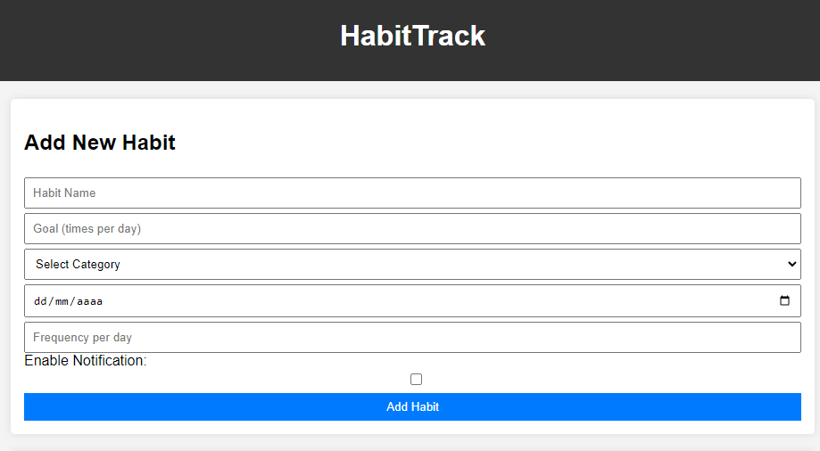

# HabitTrack

HabitTrack é uma aplicação web simples projetada para ajudar usuários a gerenciar e acompanhar seus hábitos diários, reforçando rotinas positivas através de lembretes e notificações.

## Interface

  

## Sumário

- [Tecnologias Utilizadas](#tecnologias-utilizadas)
- [Status](#status)
- [Descrição](#descrição)
- [Funcionalidades](#funcionalidades)
- [Explicação](#explicação)
- [Como Usar](#como-usar)
- [Autor](#autor)

## Tecnologias Utilizadas

  

    
  

  

    
  

  

    
  

## Status

## Descrição

HabitTrack permite aos usuários criar e manter um registro de seus hábitos diários com facilidade. Através de uma interface amigável, é possível adicionar, editar e remover hábitos, além de configurar notificações para nunca esquecer de uma atividade importante.

## Funcionalidades

- Adicionar, editar e remover hábitos.
- Definir metas e frequências para cada hábito.
- Receber notificações para hábitos conforme configurado.
- Visualizar progresso dos hábitos ao longo do tempo.
- Personalizar categorias de hábitos com cores distintas.

## Explicação

A aplicação utiliza tecnologias web básicas como HTML para estruturação da página, CSS para estilização e JavaScript para a lógica interativa e armazenamento local dos dados dos hábitos e configurações de usuário.

## Como Usar

1. Abra o arquivo `index.html` em um navegador moderno para iniciar a aplicação.
2. Utilize o formulário na página principal para adicionar novos hábitos.
3. Configure lembretes e notificações conforme necessário para manter o controle sobre suas atividades diárias.

## Autor

Desenvolvido por Diego Franco
